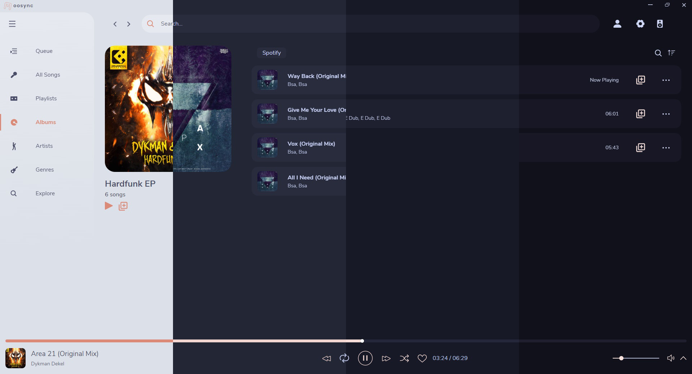
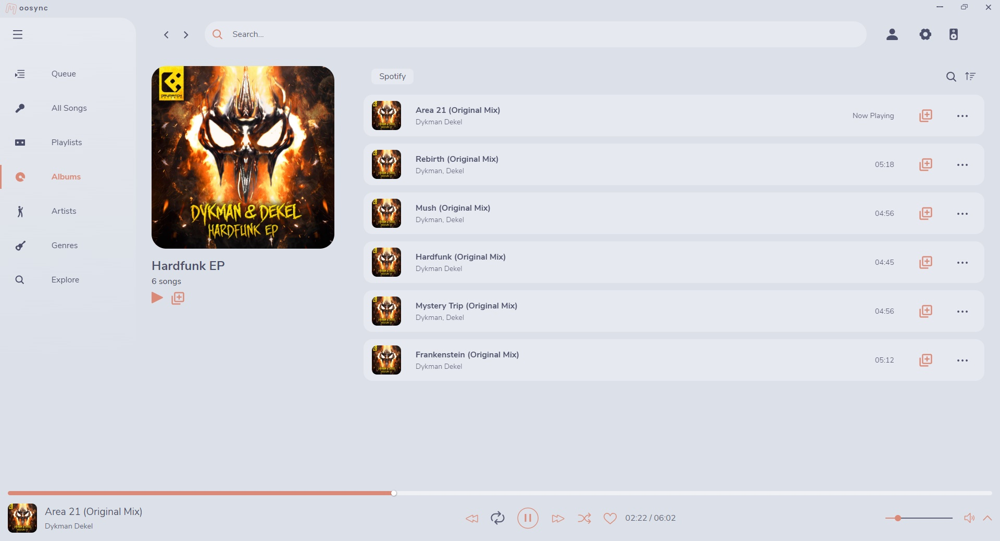
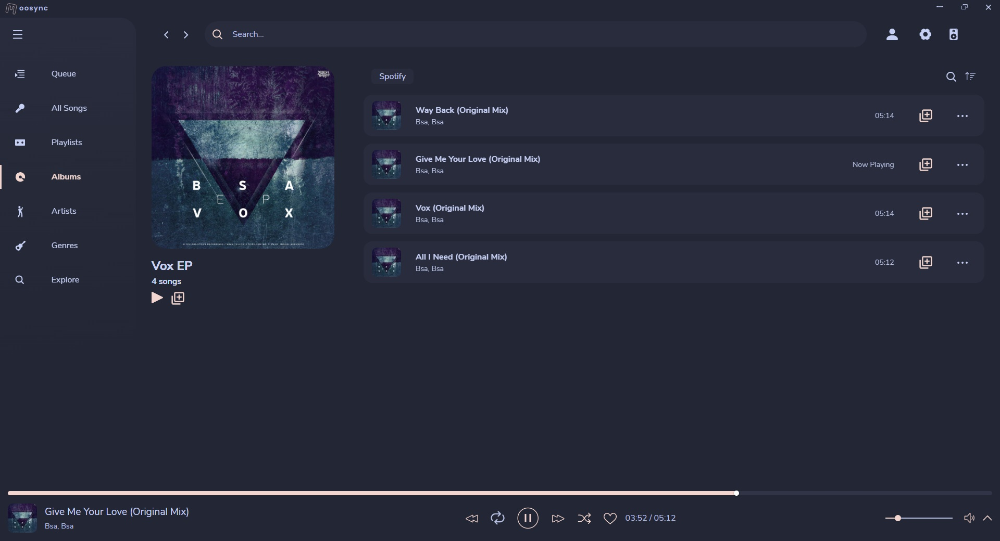
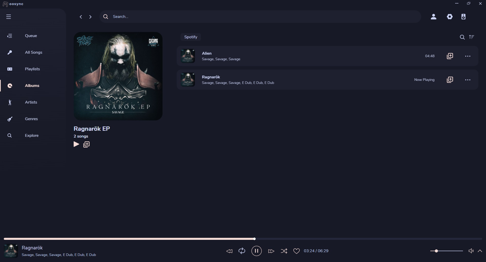

<h3 align="center">
	 
	
	Catppuccin for <a href="https://moosync.app/">Moosync</a>
	
</h3>

	
	
	

	

## Previews

🌻 Latte

🪴 Frappé

🌺 Macchiato

🌿 Mocha

## Usage

1. Clone this repository locally
2. Open the app's settings
3. Select `Themes`, then `New Theme`, `Import Theme` and browse to where you cloned Catppuccin
4. Select whicever flavour you like and import the `.mstx` file

### Old version
1. Clone this repository locally
2. Open the app's settings
3. Open `<theme>.json` of your liking, copy the entire file
4. Select `Themes`, then `New Theme`, all fields (Title, Author and colors) should auto populate with the contents of the json file
5. Click `Save` and select your theme

<!-- this section is optional -->
## 💝 Thanks to

- [N3ttX](https://github.com/ApplePie420)

&nbsp;

	

	Copyright &copy; 2021-present <a href="https://github.com/catppuccin" target="_blank">Catppuccin Org</a>

	

